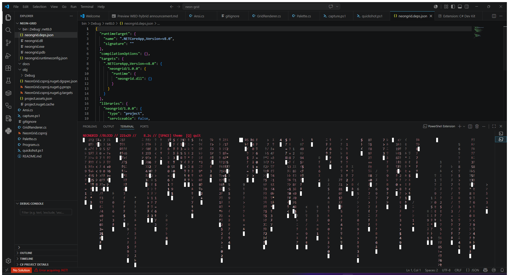

# NEONGRID



> **Scope:** This repository is dedicated to **C-family / systems languages only** —
> C, C++, and C#. It exists to demonstrate work outside the JavaScript/TypeScript
> stack. No React, no Node, no web frameworks live here.

A zero-dependency **C#** cyberpunk "digital rain" terminal visualizer. Pure
console, raw ANSI true-color escape codes, double-buffered diff rendering at
~30 FPS.

## Why it stands out
- **No libraries.** Just .NET'\''s `System.Console` + hand-rolled VT100/ANSI sequences.
- **Diff renderer.** Only redraws cells that actually changed — smooth on big terminals.
- **Alternate screen buffer.** Restores your scrollback cleanly on exit.
- **Live resize + hotkeys.** Resize the window or hit `SPACE` to cycle themes mid-run.
- **24-bit color.** Per-cell RGB tail fading, not the usual 16-color matrix clone.

## Build & run

Requires the [.NET 8 SDK](https://dotnet.microsoft.com/download).

```bash
cd neon-grid
dotnet run
```

Pick a theme up front:

```bash
dotnet run -- --neon    # green-cyan (default)
dotnet run -- --acid    # toxic yellow-green
dotnet run -- --blood   # magenta-red
dotnet run -- --ice     # electric blue
```

## Controls
| Key       | Action            |
|-----------|-------------------|
| `SPACE`   | Cycle color theme |
| `Q`/`Esc` | Quit              |
| `Ctrl+C`  | Quit              |

## Layout
src/

Program.cs       # entry point, render loop, input, resize handling

Ansi.cs          # VT100/ANSI escape-code helpers (true color, cursor, alt screen)

Palette.cs       # cyberpunk themes + head->tail RGB interpolation

GridRenderer.cs  # falling-stream sim + double-buffered diff frame composer

<!-- guardrail test 2026-06-24T21:10:18 -->
